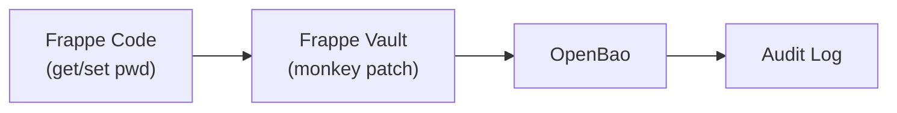

<!-- Copyright (c) 2025, AgriTheory and contributors
For license information, please see license.txt-->

# Frappe Vault Documentation

<div class="byline">
  Tyler Matteson 2026-01-17
</div>


Frappe Vault integrates OpenBao with Frappe Framework to provide enterprise-grade secret management for password fields. Instead of storing sensitive data in Frappe's database, secrets are securely stored in a dedicated OpenBao instance with full audit logging capabilities.

## What is OpenBao?

[OpenBao](https://openbao.org) is an open-source fork of HashiCorp Vault, created after HashiCorp changed Vault's license from MPL-2.0 to BSL (Business Source License) in 2023.

- **License**: MPL-2.0 (Mozilla Public License 2.0) - fully open source
- **Governance**: Governed by the [Open Source Security Foundation (OpenSSF)](https://openssf.org/)
- **API Compatibility**: Maintains API compatibility with Vault OSS v1.14.x
- **Purpose**: Identity-based secrets and encryption management

OpenBao provides the same core functionality as Vault: secure secret storage, dynamic secrets, leasing and renewal, revocation, and encryption-as-a-service.

## Compliance

This integration is designed to meet compliance requirements for DCAA, CMMC, HIPAA, and SOC2 by providing:

- **Cryptographic isolation**: Secrets stored separately from application data
- **Audit trails**: All secret access logged immutably in OpenBao
- **Per-customer isolation**: Each deployment runs its own OpenBao instance
- **Credential rotation**: Support for automated password rotation via OpenBao

## Documentation

- [Developer Environment Setup](./development.md)
- [Production Environment Setup](./production.md)
- [Site Configuration](./configuration.md)
- [OpenBao Setup Guide](./openbao-setup.md)

## How It Works

Frappe Vault intercepts Frappe's password storage and retrieval functions, routing them through OpenBao instead of Frappe's `__Auth` database table.



### Supported Password Types

Frappe Vault supports two types of password storage:

| Type | Config Key | Use Case |
|------|------------|----------|
| Encrypted Passwords | `enable_vault_secrets` | API keys, secrets, retrievable passwords |
| User Login Passwords | `enable_vault_user_passwords` | User authentication (hashed) |

### Vault Secrets Management

Beyond intercepting Frappe's built-in password fields, Frappe Vault also provides an explicit secrets management layer — a `Vault Secret` doctype that lets you store, browse, and share named secrets through the Frappe UI and API.

Secrets are organised in a folder hierarchy (modelled on Frappe's `File` doctype). A folder can be shared with a user via DocShare, granting them read/write access to all secrets inside — without needing a privileged role. See [Vault Secrets Management](./configuration.md#vault-secrets-management) for full details.

| Feature | Config Key |
|---------|------------|
| Vault Secrets UI + CRUD API | `vault_secrets_api_enabled` |
| Generic OpenBao proxy endpoints | `vault_proxy_enabled` |

## Quick Start (Development)

1. **Install OpenBao** (see [OpenBao Setup Guide](./openbao-setup.md) for installation options)

2. **Install the app**:
```shell
bench get-app frappe_vault https://github.com/agritheory/frappe_vault.git
bench --site {site} install-app frappe_vault
```

3. **Set up OpenBao** (automatic configuration):
```shell
bench setup-openbao
```

4. **Start your bench** (OpenBao auto-initializes on first run):
```shell
bench start
```

5. **Set admin password** (will be stored in OpenBao):
```shell
bench --site {site} set-admin-password {password}
```

That's it! The `bench setup-openbao` command handles all configuration automatically:
- Creates OpenBao config with auto-unseal
- Adds OpenBao to your Procfile
- On first `bench start`, initializes OpenBao and saves the token to your site configval

For production setup, see the [Production Environment Setup](./production.md) guide.

## Availability

Frappe Vault treats OpenBao as a hard dependency. There is no silent fallback to Frappe's `__Auth` database table under any failure condition — silent fallback would undermine the compliance posture the app exists to enforce.

### Single Instance

When the local OpenBao instance is unreachable:

- The `/login` page redirects to a maintenance screen (`/vault-unavailable`) so users see a clear message before attempting to authenticate
- All password reads and writes fail with an explicit error

To minimize downtime on a single-instance deployment, keep OpenBao available via static-seal auto-unseal and Supervisor `autorestart`.

### HA / Failover

For high-availability deployments, OpenBao supports [Integrated Storage (Raft)](https://openbao.org/docs/configuration/storage/raft/) clustering. In a Raft cluster, a standby node is automatically promoted if the active node becomes unavailable, and Frappe Vault will resume normal operation once the new leader is reachable.

**Multi-site replication** (`vault_sync`) copies secrets to remote OpenBao nodes asynchronously for disaster recovery purposes. Remote nodes are write targets only — they are not read fallbacks. The local OpenBao instance remains the authoritative target for all reads and writes.

## Security Considerations

- **Token Security**: The OpenBao token should be provided via environment variable (`BAO_TOKEN` or `VAULT_TOKEN`) in production, not stored in site_config
- **Network Security**: OpenBao should only be accessible from the Frappe application server (bind to `127.0.0.1:8200`)
- **TLS**: External access uses Frappe's proxy API, which inherits TLS from nginx. OpenBao itself runs on localhost and does not require TLS configuration.
- **Audit Logging**: Always enable OpenBao audit logging for compliance
